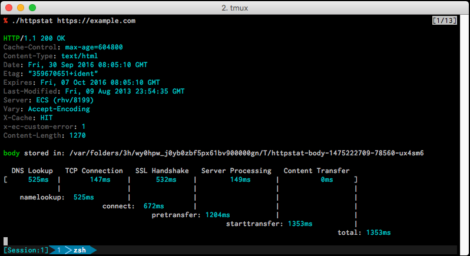

# httpstat

httpstat is a curl like tool, visualize http/https process and show the duration.



Reference from [python httpstat](https://github.com/reorx/httpstat) / [go httpstat](https://github.com/davecheney/httpstat) / [node httpstat](https://github.com/yosuke-furukawa/httpstat)

## TODO
- READMEちゃんと書く
- テキストをカラーに
- bugfix

## Usage
```
$ httpstat https://example.com/
```


## Installation

If [available in Hex](https://hex.pm/docs/publish), the package can be installed as:

  1. Add `httpstat` to your list of dependencies in `mix.exs`:

    ```elixir
    def deps do
      [{:httpstat, "~> 0.1.0"}]
    end
    ```

  2. Ensure `httpstat` is started before your application:

    ```elixir
    def application do
      [applications: [:httpstat]]
    end
    ```


## Implementations

Many thanks.

- https://github.com/reorx/httpstat
- https://github.com/davecheney/httpstat
- https://github.com/yosuke-furukawa/httpstat
- https://github.com/tcnksm/go-httpstat
- https://github.com/b4b4r07/httpstat
